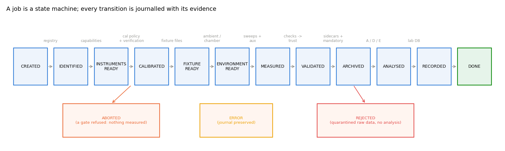
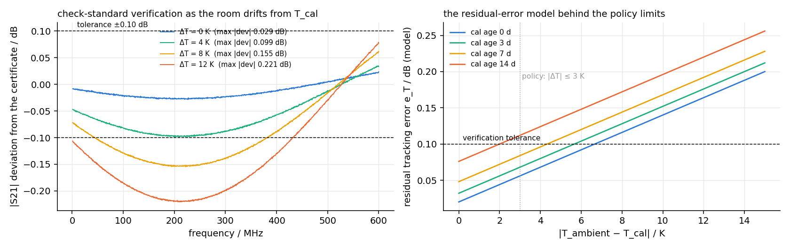
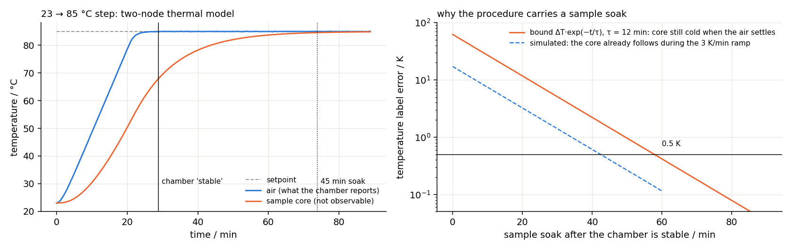
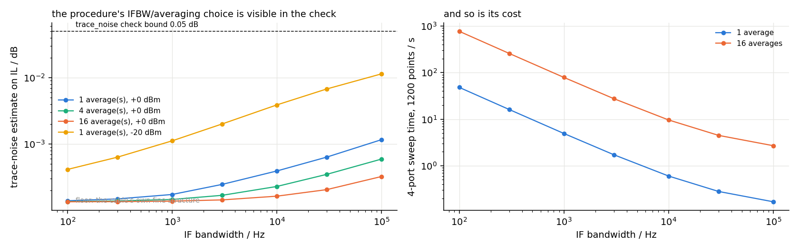
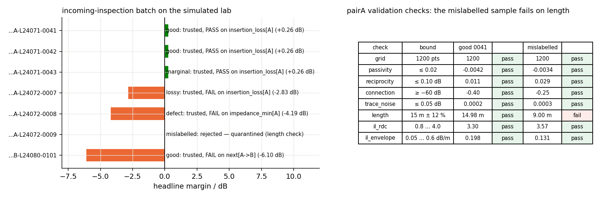
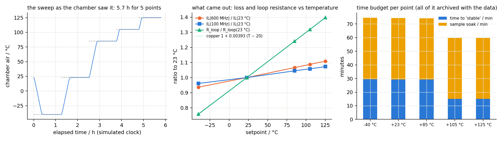

# Why a laboratory operating system

Projects A, C, D and E of this series turn measured files into engineering results. They all assume the files are right: that the analyser was calibrated and its calibration still valid; that the sample on the ports was the sample on the label; that the temperature written in the header was the temperature of the copper, not of the chamber air; that nobody forgot to terminate the far end of the second pair. None of these assumptions is checked by a Touchstone file, and all of them fail in practice. A laboratory that produces defensible data therefore needs a layer *above* the instrument scripts that knows what a measurement is and refuses to produce one it cannot vouch for.

`labauto` is that layer. Its design follows three decisions.

**Procedures are data, the engine is generic.** Everything specific to a test — instrument requirements, sweep settings, calibration policy, port maps, checks, mandatory metadata, downstream analysers — is a TOML procedure with a SHA-256 hash. The engine contains no cable-specific code; adding a test is a new file, adding an instrument is a driver entry, changing the meaning of "trustworthy" is a check.

**Every job is a journalled state machine with gates.** A job goes `CREATED → IDENTIFIED → INSTRUMENTS_READY → CALIBRATED → FIXTURE_READY → ENVIRONMENT_READY → MEASURED → VALIDATED → ARCHIVED → ANALYSED → RECORDED → DONE`, and each transition is written to a journal with a timestamp and its evidence (the calibration decision, the check values, the chamber log). Three terminal states exist besides `DONE`: `ABORTED` when a gate refuses before measuring, `REJECTED` when the data fails validation after the allowed repeats (the raw data is archived in quarantine, not analysed, never entered into the engineering database) and `ERROR` for exceptions, with the journal preserved.

**The raw archive is the source of truth.** Accepted files are written exactly as the instrument returned them (fixture not removed), each with a sidecar record, and the whole job directory is sealed with a manifest of SHA-256 hashes [@fips180]. Analyses read only from the archive, so `labauto replay` can re-run them six months later and report whether verdict and headline margin still agree — which is the operational definition of reproducibility this report adopts, and what ISO/IEC 17025's traceability and record-keeping clauses ask a laboratory to be able to show [@iso17025].



# Architecture

## Roles, drivers, capabilities

A laboratory configuration (`lab.toml`) names instruments by *role* — `vna`, `chamber`, `dmm`, `scanner` — and *driver* — `vna.scpi`, `vna.sim`, `chamber.scpi`, … Each driver exposes a role interface and a `Capabilities` record (port count, frequency range, temperature range, feature set). A procedure states requirements per role:

```toml
[requires.vna]
ports = 4
fmax_hz = 600e6
features = ["s-parameters", "calsets"]
[requires.dmm]
optional = true
features = ["4-wire-resistance"]
```

and the engine checks them against the instruments actually present before anything else happens. A procedure needing four ports to 600 MHz is refused on a two-port 300 MHz analyser with a message naming the shortfall; an optional role that is absent is recorded as such and its auxiliary measurement skipped.

## Transports and dialects

All instruments are reached through a `Transport` (raw TCP socket in SCPI "socket mode", VISA when `pyvisa` is installed [@ivi_visa], or an in-process simulator). Command strings are generated from a *dialect* table so that instrument-family differences are configuration, not code: the default dialect is the Keysight PNA/ENA family style (`SENS1:FREQ:STAR`, `CALC1:DATA:SNP:PORT?`) [@keysight_pna_prog]; an R&S ZNB dialect overrides the handful of entries that differ (calibration-set loading, single-sweep triggering) [@rs_znb_manual]. Every setting written is read back, and the read-back — not the request — goes into the metadata, following the principle that a record should say what the instrument *was*.

The simulators parse the same strings. SCPI allows long and short mnemonics and numeric suffixes (`SENSe1:FREQuency:STARt` ≡ `SENS:FREQ:STAR`), so a normaliser implements the short-form rule of SCPI-99 §6.2 [@scpi1999; @ieee4882]: take the first four characters of the long mnemonic, drop the fourth if it is a vowel, strip trailing digits. The simulators match on the canonical form, which means the driver's exact command strings are exercised in every test.

## Identity: barcodes and the registry

A sample enters a job as a *scan*. Two label schemes are parsed. GS1-128 element strings carry the part as a GTIN (AI 01), the lot (AI 10) and the serial (AI 21), either in parenthesised human-readable form or with the FNC1 separator; the GTIN check digit is verified with the GS1 mod-10 weights (3, 1, 3, …) [@gs1genspec]. The laboratory's own scheme is `PART-LOT-SERIALc` with a check character $c$ computed as a position-weighted sum of the Code-39 character values,

$$c = \mathcal{A}\!\left[\Big(\sum_{i=1}^{n} i\, v(s_i)\Big) \bmod 36\right],$$

where $s_1\ldots s_n$ are the characters before $c$, $v(\cdot)$ their Code-39 values and $\mathcal{A}$ the alphanumeric alphabet. Position weighting catches transpositions as well as substitutions, which an unweighted sum does not. A scan is then *resolved* against the registry, a CSV exported from the production system with the sample id, part number, lot, cable type and nominal length. A scan with a wrong check character, or one not in the registry, or whose registered cable type is not the type the procedure tests, aborts the job: a measurement without a resolved identity cannot be archived.

# Calibration management

## Records and policy

A calibration is *known* by a record (instrument serial, calibration-set name on the instrument, type, ports, date, ambient temperature at calibration, operator, kit serial and kit due date, verification history) and *trusted* by a policy evaluated at job time. With $t$ the current time, $t_{\text{cal}}$ the calibration time, $T$ the ambient temperature and $T_{\text{cal}}$ the temperature at calibration, the record is *invalid* unless

$$\frac{t - t_{\text{cal}}}{1\,\text{day}} \le A_{\max}, \qquad |T - T_{\text{cal}}| \le \Delta T_{\max}, \qquad \text{kit due date} > t,$$

and the procedure's ports are a subset of the calibrated ports with the required calibration type. A record that passes these is *valid* only if it also carries a *proof*: a verification against a check standard that passed and is not older than $V_{\max}$ hours; otherwise it *needs verification*, which the engine performs before measuring. The instrument's own "correction on" flag is necessary but not sufficient — it says a cal set is active, not that it is still right.

The limits are not arbitrary. The residual errors of a vector-corrected measurement grow with what the calibration cannot know: cable and connector drift with temperature and time [@keysight_an1287_3; @euramet_cg12]. The simulator implements the model

$$e_T = e_0 + k_T\,|T - T_{\text{cal}}| + k_a\,\frac{t - t_{\text{cal}}}{1\,\text{day}}, \qquad e_0 = 0.02\ \text{dB},\ k_T = 0.012\ \text{dB/K},\ k_a = 0.004\ \text{dB/day},$$

for the peak residual transmission-tracking error, applied as a slowly rippling multiplicative error on every transmission term, together with a residual directivity of $-52$ dB (degrading at the same rates) added to every reflection term. These numbers are typical of a four-port SOLT or electronic calibration on a mid-range analyser with phase-stable cables; with them, a 3 K ambient excursion on a fresh calibration costs about 0.06 dB and a 7-day-old calibration at 3 K about 0.09 dB — just inside a 0.1 dB verification tolerance, which is why the shipped policy uses $A_{\max} = 7$ days and $\Delta T_{\max} = 3$ K (figure \ref{fig:cal}, right).

## Verification against a check standard

Verification measures a certified two-port — here a 20 dB attenuator with a reference file $S^{\text{ref}}(f)$ — on each port pair named in the policy and compares:

$$\Delta A = \max_f \Big| 20\log_{10}|S_{21}^{\text{meas}}| - 20\log_{10}|S_{21}^{\text{ref}}| \Big| \le \tau_A,\quad
\Delta\varphi = \max_f \big|\arg\big(S_{21}^{\text{meas}}\,\overline{S_{21}^{\text{ref}}}\big)\big| \le \tau_\varphi,\quad
\min_f\, \mathrm{RL}_{ii} \ge \rho_{\min},$$

with $\mathrm{RL}_{ii} = -20\log_{10}|S_{ii}^{\text{meas}}|$ and the phase difference taken as the argument of the product with the conjugate so that no unwrapping is needed. The result (pass/fail, the three worst values, per-pair details) is appended to the calibration record and to the laboratory database, and the verification sweeps themselves are archived. Figure \ref{fig:cal} (left) shows the deviation trace as the simulated room drifts from the calibration temperature: at 4 K it is still inside tolerance, at 8 K it is not — the engine would have refused the job at the policy gate ($\Delta T_{\max} = 3$ K) before even measuring the standard, which is the point of having two layers.



# The environment

## Ambient

Every procedure states an ambient window; the engine reads the ambient (from the chamber's sensor when present) and aborts outside it. The ambient is also what the calibration policy's $|T - T_{\text{cal}}|$ uses.

## Climate chamber: stability and soak

A temperature-sweep procedure names its points and a stability criterion. The engine sets the chamber, then waits until the air temperature $T_a(t)$ has stayed within $\pm\delta$ of the setpoint for $t_s$ seconds *and* its slope over that window is below $\dot T_{\max}$:

$$|T_a(t') - T_{\text{set}}| \le \delta\ \ \forall\, t' \in [t - t_s, t], \qquad \left|\frac{T_a(t) - T_a(t - t_s)}{t_s}\right| \le \dot T_{\max}.$$

The defaults are $\delta = 0.5$ K, $t_s = 300$ s, $\dot T_{\max} = 0.2$ K/min. This is what the chamber can see. What it cannot see is the sample: a coiled cable on a rack follows the air with a thermal time constant $\tau_d$ set by its heat capacity and the convective coupling [@incropera2007]. The simulator uses a two-node model,

$$\frac{dT_a}{dt} = \frac{T_r(t) - T_a}{\tau_a}, \qquad \frac{dT_d}{dt} = \frac{T_a - T_d}{\tau_d},$$

where $T_r(t)$ is the controller's internal setpoint ramping at the chamber's slew limit (3 K/min), $\tau_a = 90$ s and $\tau_d = 12$ min. After the chamber declares itself stable the core is still $\Delta T e^{-t/\tau_d}$ away from the air in the worst case; the procedure therefore carries a *sample soak* (45 min in the shipped sweep, $\approx 4\tau_d$) before the sweep is triggered, and the sidecar records the air temperature after the soak as the sample temperature together with the method by which it was inferred, so that a reader can judge the label. Figure \ref{fig:chamber} shows a 23 → 85 °C step: the chamber is "stable" after 29 min, the core is within 0.5 K of the air 40 min later. The full temperature log of the wait — every sample, the setpoint, the criterion — is archived with the measurement; environmental test standards ask for exactly this evidence of conditioning [@iec60068].



# Measurement-aware validation

After every sweep the engine runs the checks the procedure names, each a small physical argument about what a correct measurement of *this* sample with *this* procedure must satisfy. Each returns pass / warn / fail together with the value it looked at and the bound it used, so the archived record shows not only that the data was accepted but why. In what follows $\mathbf{S}(f)$ is the measured single-ended matrix, $S_{dd21}(f)$ the differential transmission of the through pair obtained by the standard mixed-mode conversion [@bockelman1995], $\mathrm{IL}(f) = -20\log_{10}|S_{dd21}|$, and $L_{\text{reg}}$ the registry length.

**Grid.** The returned frequency vector must equal the procedure's grid to within 1 Hz; an analyser that silently coerced the point count or span has produced a different measurement.

**Passivity.** A passive device cannot amplify: the largest singular value of $\mathbf{S}(f)$ must satisfy $\sigma_{\max}(f) - 1 \le \epsilon_p$ at every frequency ($\epsilon_p = 0.02$; warn to $2\epsilon_p$). Calibration errors violate this first.

**Reciprocity.** Passive cables are reciprocal: $\max |20\log_{10}(|S_{ij}|/|S_{ji}|)| \le \epsilon_r$ over all pairs with both terms above $-50$ dB ($\epsilon_r = 0.1$ dB). Source-match and tracking errors are non-reciprocal, as is a loose connector on one port.

**Connection.** $\max_f (-\mathrm{IL}) \ge -60$ dB — otherwise nothing is connected. For crosstalk-only files, the median single-ended return loss must exceed 3 dB.

**Trace noise.** The random component of the trace is estimated from the second differences of $\mathrm{IL}$ in dB: for white noise of standard deviation $\sigma$ the second difference has variance $6\sigma^2$, so

$$\hat\sigma = \frac{\operatorname{std}\big(\mathrm{IL}_{k+1} - 2\,\mathrm{IL}_k + \mathrm{IL}_{k-1}\big)}{\sqrt 6} \le \sigma_{\max},$$

with $\sigma_{\max} = 0.05$ dB. The estimate has a floor from the cable's own fine structure (impedance ripple, roughness), so it is a bound, not a noise measurement; it is what makes a wrong IF bandwidth or power setting visible in the record (figure \ref{fig:noise}).

**Electrical length.** The group delay $\tau_g = -\frac{1}{2\pi}\frac{d\varphi}{df}$ is obtained from a linear fit of the unwrapped phase of $S_{dd21}$ over the middle 60 % of the band, and the electrical length $L_{\text{el}} = c_0\,\mathrm{NVP}\,\tau_g$ compared with the registry: pass if $|L_{\text{el}} - L_{\text{reg}}| \le 12\,\%$ of $L_{\text{reg}}$, warn to 24 %, fail beyond. This is the check that catches a mislabelled sample — a different cable with the right sticker — which no analysis of the file alone can detect.

**Insertion loss against the DC loop resistance.** When the procedure includes the four-wire loop resistance $R_\ell$ of the pair, the low-frequency insertion loss of a matched line is bounded below by conductor loss alone: with $\alpha_c = R'/(2Z_d)$ [@paul2008] and $R' = R_\ell/L$ at DC,

$$\mathrm{IL}_{\text{dc}} = 8.686\,\frac{R_\ell}{2 Z_d}\ \ \text{dB}, \qquad 0.8 \le \frac{\mathrm{IL}(f_{\min})}{\mathrm{IL}_{\text{dc}}} \le 4,$$

with $Z_d = 100\ \Omega$. At 1 MHz the skin depth in copper (65 µm) is already a quarter of a 0.5 mm conductor's radius, so the ratio sits around 2–3 for a healthy pair; a ratio below 0.8 means the analyser sees a shorter or fatter cable than the ohmmeter did (wrong sample, wrong port), far above 4 a bad connection or a missing calibration. The ohmmeter is the second instrument of the procedure and the reason the architecture is multi-instrument from the start.

**Loss envelope.** $\mathrm{IL}(100\ \text{MHz})/L_{\text{reg}}$ must lie in a plausible band for a data pair (0.05–0.6 dB/m by default): a coarse sanity bound on the cable-type/registry pairing.

**Far-end termination (crosstalk files).** A near-end crosstalk file has only the near ends on the analyser; the operator must terminate the far ends. An open far end reflects almost everything at low frequency, where the cable loss is negligible: $|S_{ii}| \to e^{-2\alpha L} \approx 1$, i.e. a single-ended return loss of a fraction of a decibel. The check requires $\min \mathrm{RL}_{ii} \ge 8$ dB over the lowest 5 % of the band. In the demonstration this is what catches a forgotten termination on the second pair (the through files barely notice it at 1 % coupling; the NEXT file does).

**Instrument errors.** The analyser's error queue is drained after every sweep; any entry fails the sweep.

## Trust decision and repeats

The statuses map to a trust level: any *fail* → `rejected`, any *warn* without fail → `flagged`, otherwise `trusted`. The procedure's `repeat_on` list says which levels trigger a repeat (the operator is asked to check the hook-up and torque, and the sweep is taken again, up to `max_repeats`), and `quarantine_on` which levels prevent analysis. Flagged data is analysed and recorded with its flags; rejected data is archived in quarantine — never discarded, because a rejected sweep is evidence too — and never reaches the engineering database. The attempt number of every sweep is in its sidecar.



# Archive, metadata and reproducibility

## Layout and sealing

Every job that measured anything gets a directory `archive/<year>/<job_id>/` (or `archive/<year>/quarantine/<job_id>/`) containing the raw Touchstone files exactly as measured, one sidecar `<file>.meta.json` per file, `aux.json`, `procedure.toml` (the text that ran), `journal.jsonl`, an `analysis/` directory with whatever the analysers produced, and finally `manifest.json` with the SHA-256 of every other file and the job summary. `labauto archive verify` recomputes every hash and reports modified, missing and unlisted files. The manifest is written last, after the analysis, so a sealed job is a complete one.

## The sidecar

The sidecar is the record that makes a file defensible. Its sections are: `sample` (registry entry and parsed barcode), `procedure` (id, version, SHA-256, sweep and check settings), `instrument` (per role: the parsed `*IDN?` fields, address, dialect, and the full read-back state — for the analyser the sweep as read back, the active calibration set and the correction flag), `calibration` (record id, date, type, ports, the policy decision with its age and $\Delta T$, the verification result with its three metrics and tolerances), `fixture`, `environment` (ambient, humidity, and for sweeps the chamber identity, setpoint, time to stable, soak, criterion, the temperature log, and the sample temperature with the method by which it was inferred), `measurement` (file, SHA-256, ports, port map, attempt, sweep time, timestamp), `validation` (every check with value and bound, the file's and the job's trust), `aux`, `operator`/`site`, and `software` (labauto, cablecheck, numpy, Python, platform, git commit, and the versions of the optional analysers or `null`). The procedure lists which dotted paths are *mandatory* — for the shipped 1000BASE-T1 procedure, among others, `calibration.verification.status`, `instrument.vna.calset_active` and `procedure.hash` — and the engine refuses to archive a record with any of them missing: the job ends in `ERROR` with the missing paths named, and nothing is sealed. A sidecar example is in `figures/sidecar_example.json`.

## Replay

`labauto archive replay` re-runs the mandatory analyser (project A's `cablecheck`) on the archived raw files with the archived port maps and fixture settings and compares verdict and headline margin with the sealed result. Three outcomes are possible and all are informative: *reproduced* (the archive and the software still agree), *differs* (a software change altered an engineering result — the archived software versions say which change), or *integrity failure* (a file no longer matches its hash). Quarantined jobs are reported as skipped, since they hold raw data only. In the demonstration all seven analysed jobs reproduce bit-for-bit under the same software.

## Databases

Two databases index the archive. `cablecheck`'s own results database (project A) receives one run per accepted job with its traces and margins. The laboratory database (`lab.sqlite`) holds one row per job (identity, procedure id/version/hash, operator, site, state, trust, verdict, headline, temperature, calibration id, archive path, attempts, and the full summary as JSON), one row per archived file with its hash, every calibration decision and verification taken, and a snapshot of every instrument's identity and state at every job. Together they answer the laboratory's questions — what was measured when, on which calibration, with what trust, where the raw data lives — and they are the substrate the multi-site platform of project F builds on.

# Batches and sweeps

A *batch* is a procedure plus a list of scans (from a file, or from the scanner one by one until an empty scan). Each scan becomes a job; a state file records what finished so `--resume` skips it after an interruption. A *temperature sweep* is a list of setpoints run as separate jobs of a temperature-sweep procedure sharing a campaign id: each point has its own calibration check, environment wait, validation, sidecar, seal and analysis, and the sweep writes a summary table (setpoint, sample temperature, state, trust, verdict, headline margin, IL at 100 and 600 MHz, loop resistance, archive path). The files are named `pairA_T+085C.s4p` so that project E's `cableanalytics derate` consumes a sweep directory unchanged. `--dry-run` walks every gate — identity, capabilities, calibration policy, fixture files, environment — and reports the plan and a time estimate without measuring, which is what one runs before committing a chamber for six hours.

# The simulated laboratory

The point of the simulators is not realism for its own sake but that the engine, the drivers and the procedures are exercised on their real code paths against instruments that misbehave in the ways real ones do.

**Bench.** What is connected to which port is the bench's state; the engine's prompts re-wire it. Devices are cable samples built from registry entries (project A's `PairSpec` synthesis with a seed from the sample id, temperature dependence $R'(T) = R'_{20}(1 + \alpha_\rho \Delta T)$, $\tan\delta(T) = \tan\delta_{20}(1 + \beta_d\Delta T)$, $C'(T) = C'_{20}(1 + \gamma_c\Delta T)$ with $\alpha_\rho = 0.00393$/K, $\beta_d = 0.004$/K, $\gamma_c = 1.2\times10^{-4}$/K [@haynes2016]), and a `sim_profile` column marking a sample as good, marginal, lossy (badly foamed, high-resistivity alloy), defective (a 40 cm, 60 % capacitance bump a quarter of the way along) or mislabelled (a 9 m cable carrying a 15 m label); the check standard; a 2x-thru; and "nothing". Device ports not on the analyser are terminated in the reference impedance, or, with `unused_ports = "open"`, left dangling — the forgotten-termination scenario.

**Analyser.** A SCPI server with instrument state, an error queue (`-222 Data out of range`, `-224 Illegal parameter value`, `-113 Undefined header`), calibration sets, the residual-error model of §3, an uncorrected mode (directivity $-20$ dB, $\pm0.5$ dB tracking ripple, 15 % non-reciprocal source-match ripple), complex Gaussian trace noise with

$$\sigma_{\text{dB}} = -100\ \text{dBc} + 10\log_{10}\frac{\mathrm{IFBW}}{1\ \text{kHz}} - 10\log_{10}N_{\text{avg}} - P_{\text{dBm}},$$

a connector-repeatability term of 0.01 dB, and a sweep time $N_{\text{pts}}\,(1/\mathrm{IFBW} + 25\ \mu\text{s})\,N_{\text{ports}}\,N_{\text{avg}}$ spent on the clock. Its `CALC:DATA:SNP:PORT?` reply is the frequency vector followed by real and imaginary parts of the S-parameters in row order, which is the Keysight convention [@keysight_pna_prog]; the driver's `snp_order` dialect entry exists because this is the first thing to verify on a real instrument.

**Chamber and ohmmeter.** The two-node thermal model of §4 with a 3 K/min slew limit and 0.04 K sensor noise, driven by the simulated clock so that waits are integrated rather than slept; a four-wire ohmmeter reading the model's loop resistance with contact noise.

**Clock.** Everything that waits asks a `Clock`; `SimClock` advances only when something sleeps on it and steps the chamber model as it goes. The identical engine code therefore runs the real laboratory in real time and the simulated one in simulated time — a five-point sweep with 45-minute soaks (5.7 simulated hours, figure \ref{fig:sweep}) runs in about ten seconds.

# Demonstration

`labauto init-demo` writes a complete simulated laboratory: `lab.toml`, a registry of eight samples, a calibration record two days old and never verified with its check-standard reference file, and batch and sweep specifications. The batch of six 1000BASE-T1 samples (figure \ref{fig:batch}) plays out as follows. The first job finds the calibration policy-valid but unverified, prompts for the check standard on ports 1–2 and 3–4, verifies it ($\Delta A = 0.038$ dB, $\Delta\varphi = 0.41°$, RL 42 dB), records the proof, and measures; the remaining jobs reuse the proof. Three good/marginal samples pass with insertion-loss headline margins of +0.26 dB (the 1000BASE-T1 link-segment limit is tightest at 1 MHz for a 15 m segment [@ieee8023bp]); the lossy sample fails insertion loss by 2.8 dB; the defective sample fails the minimum-impedance limit (windowed profile minimum about 86 Ω against 90 Ω; the plain TDR profile of project A dips to about 85 Ω at 3.7 m, and project D's loss-aware reconstruction, run as an analyser on the same archived file, reads about 77.5 Ω — the simulated bump is a 60 % capacitance excess, i.e. 79 Ω true, so the loss-aware engine is the one that gets it right); and the mislabelled sample fails the electrical-length check at both attempts (9.00 m from a 44.1 ns group delay against a 15 m label), is quarantined with its raw data, sidecars and journal, and never reaches the engineering database (five runs in `cablecheck`'s database, six trusted plus one rejected job in the laboratory database). The two-pair procedure measures pair A, pair B and the near-end crosstalk file in three hook-ups and fails the sample on NEXT, as a 1 %-coupled unscreened pair should against that limit. With the forgotten-termination scenario switched on, the through files are still trusted (a 1 %-coupled open pair changes them by 0.007 dB) but the NEXT file fails far-end termination on both attempts and the job is rejected — the check found the operator error the data alone would have hidden.



The temperature sweep (figure \ref{fig:sweep}) runs −40, 23, 85, 105 and 125 °C as five jobs. Each waits for the chamber (15–30 min), soaks the sample 45 min, measures the loop resistance and the pair, validates, seals and analyses. The loop resistance rises by the copper coefficient (ratio 125 °C/23 °C of 1.397 against $\frac{1 + 0.00393\cdot105}{1 + 0.00393\cdot3} = 1.396$), the insertion loss at 600 MHz by 11 % and at 100 MHz by 7 % — the conductor term scaling as $\sqrt{1 + \alpha_\rho\Delta T}$ and the dielectric term linearly, which is what project E's derating fit then extracts from these files. Every point's sidecar holds the chamber log and the time budget; all five replay.



# Bringing it up on real hardware

The simulators make the software testable; they do not make it correct on an instrument nobody has connected. The bring-up list, in order: (1) `labauto idn TCPIP::<host>::5025::SOCKET` — the transport, terminator and `*IDN?` parsing; (2) `labauto instruments` — the capability queries and every read-back in the dialect; (3) `labauto cal list` — the calibration-set catalogue command and its quoting; (4) a manual `measure()` on a thru, checking the `snp_order` of the `CALC:DATA:SNP:PORT?` reply against a Touchstone saved by the instrument's own front panel, and the point count; (5) `labauto cal verify` with the laboratory's real check standard and its certificate as `check_att20.s2p` (or any two-port reference); (6) one job with `--dry-run`, then one for real, reading the sidecar line by line; (7) the chamber protocol — most chambers are not SCPI, so a dialect table or a small adapter class implementing `setpoint`, `temperature` and `output` is expected; the stability criterion and soak logic are protocol-independent. The check bounds shipped in the procedures are starting points to be tuned on the laboratory's own repeatability data; the repository's `procedures/` directory is where a laboratory keeps its own.

# What this does and does not show

Shown: a generic, multi-instrument, multi-procedure orchestration engine with gates and journalled state; a calibration policy with verification and a residual-error rationale for its limits; an environment model that makes the sample-temperature label honest; eight measurement-aware checks with their physics; a hashed archive with mandatory-metadata enforcement and a replay that re-derives the engineering result; hand-off to projects A, D and E; and 25 tests that exercise all of it through the drivers' real command strings on simulators, including the forgotten termination, the mislabelled sample, the stale calibration, the warm room, the sloppy calibration, the two-port analyser, the wrong cable type, the unknown scan and the operator abort.

Not shown: any real instrument. The residual-error, noise and thermal models are plausible and internally consistent, but their constants are assumptions, and the SNP data order is the Keysight convention as documented, not as observed. The checks' bounds are engineering judgement, not derived from a repeatability study. The uncertainty of the archived quantities is not evaluated — the sidecar carries the ingredients (calibration verification deviations, trace-noise estimate, temperature-label method) that an uncertainty budget per GUM would use [@gum2008], but no budget is computed; that belongs with the repeatability-and-reproducibility analysis of project F. Finally, the laboratory database is a single-site SQLite index; cross-site comparison, control charts and $E_n$ scores are project F's subject, for which this archive and its metadata are the input.

# References
